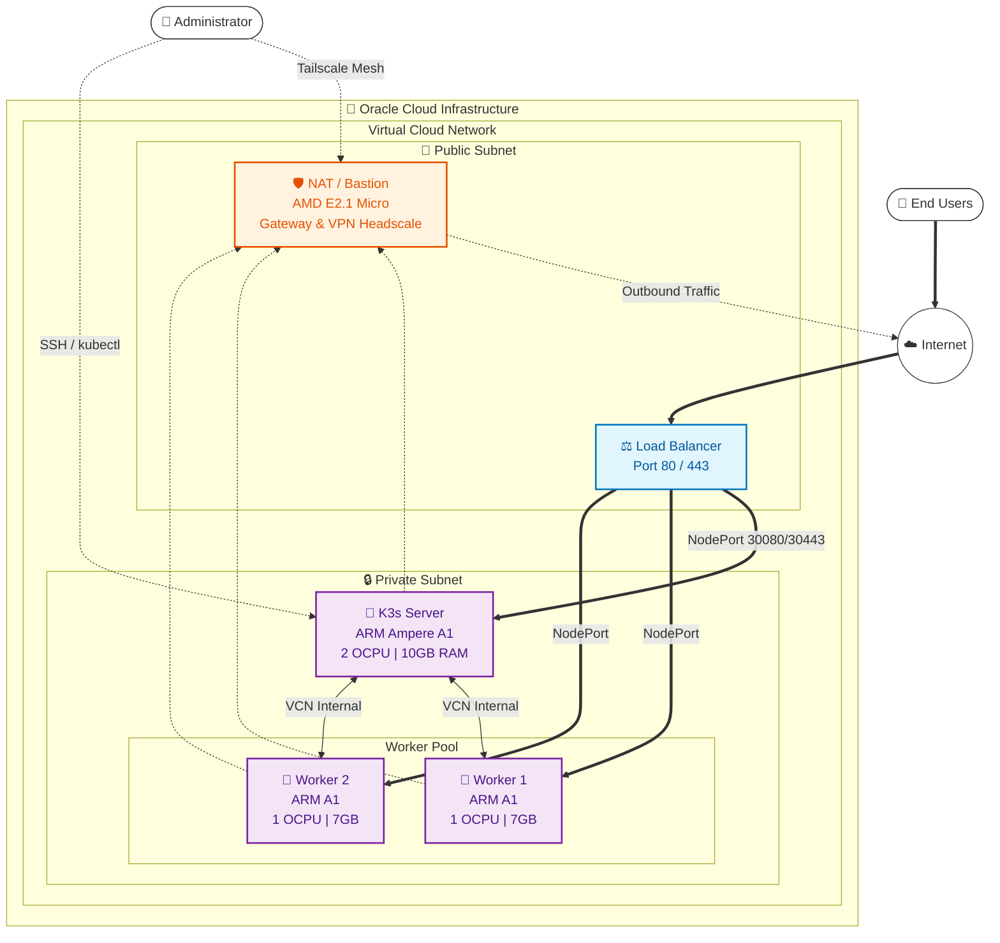

# OCI Cloud Foundation

Este projeto contém código Terraform/OpenTofu para provisionar uma infraestrutura completa de Kubernetes (K3s) na Oracle Cloud Infrastructure (OCI), focada em maximizar os recursos do tier **Always Free**.

## 🏗 Arquitetura

A infraestrutura é projetada para rodar um cluster K3s seguro e eficiente, utilizando a arquitetura ARM (Ampere) da OCI para os nós do cluster e uma instância AMD Micro para NAT e Bastion.


### Componentes:
*   **1x VM NAT (AMD E2.1.Micro)**:
    *   Atua como Gateway NAT (Masquerading) para as instâncias privadas.
    *   Possui IP Público.
    *   Configurada com Tailscale para acesso VPN seguro.
*   **1x K3s Server (ARM Ampere A1)**:
    *   Control Plane do Kubernetes.
    *   2 OCPUs, 10GB RAM.
    *   Subnet Privada (sem IP público direto).
    *   Conectado via Tailscale para administraçao segura (`kubectl`).
*   **2x K3s Workers (ARM Ampere A1)**:
    *   Nós de trabalho.
    *   1 OCPU, 7GB RAM cada.
    *   Subnet Privada.
*   **Rede**:
    *   VCN com Subnet Pública (para NAT/Load Balancers) e Privada (para K3s).

> **Nota sobre o Always Free**: Esta arquitetura utiliza o limite de 200GB de Block Volume gratuito (4 instâncias x 50GB = 200GB), além das 4 OCPUs e 24GB de RAM disponíveis no tier gratuito da OCI para instâncias ARM.

---

## 🚀 Pré-requisitos

1.  **Conta Oracle Cloud (OCI)**: Com acesso ao tier Always Free.
2.  **Conta Tailscale**: Para gerar a Auth Key e gerenciar a VPN.
3.  **OpenTofu** (>= 1.5.0) ou **Terraform**.
4.  **Par de Chaves SSH**: Para acesso de emergência às VMs.

## 🛠 Configuraçao

1.  Clone este repositório:
    ```bash
    git clone https://github.com/luccaluchi/oci-cloud-foundation.git
    cd oci-cloud-foundation/oci
    ```

2.  Crie um arquivo `terraform.tfvars` baseado no exemplo:
    ```bash
    cp terraform.tfvars.example terraform.tfvars
    ```

3.  Edite o arquivo `terraform.tfvars` com suas credenciais:

    ```hcl
    # OCI Authentication
    tenancy_ocid     = "ocid1.tenancy.oc1..aaaaaaa..."
    user_ocid        = "ocid1.user.oc1..aaaaaaa..."
    fingerprint      = "xx:xx:xx:xx:..."
    private_key_path = "~/.oci/oci_api_key.pem"
    region           = "sa-saopaulo-1"

    # SSH
    ssh_public_key_content = "ssh-ed25519 AAAAC3NzaC1lZDI1NTE5..."

    # Tailscale
    tailscale_auth_key = "tskey-auth-kCY..." # Gere uma chave "Reusable" e "Ephemeral" no painel do Tailscale

    # Budget (Opcional)
    budget_amount      = 50
    budget_alert_email = "seu-email@exemplo.com"
    ```

## 📦 Como Provisionar

Execute os comandos do Tofu dentro da pasta `oci/`:

1.  **Inicializar**:
    ```bash
    tofu init
    ```

2. **Criar Workspace**
    ```bash
    tofu workspace new dev
    tofu workspace new prod
    ```

3. **Selecionar Workspace**
    ```bash
    tofu workspace select prod
    ```

4.  **Planejar**:
    ```bash
    tofu plan
    ```

5.  **Aplicar**:
    ```bash
    tofu apply
    ```
    *Dica: O processo pode levar alguns minutos enquanto as instâncias sao provisionadas e os scripts de cloud-init instalam o K3s e o Tailscale.*

## 🔐 Acesso e Gerenciamento

O acesso ao cluster e às VMs é realizado primordialmente através do **Tailscale**, eliminando a necessidade de expor portas SSH ou a API do Kubernetes para a internet pública.

### Acessando o Cluster K3s
1.  Certifique-se de que sua máquina local está conectada à sua rede Tailscale.
2.  Acesse a VM `k3s-server` via SSH (pelo IP do Tailscale) e copie o kubeconfig:
    ```bash
    # Exemplo
    ssh ubuntu@<IP-TAILSCALE-K3S-SERVER> "sudo cat /etc/rancher/k3s/k3s.yaml" > ~/.kube/config
    # Ajuste o endereço do server no kubeconfig para o IP do Tailscale
    ```
3.  Utilize o `kubectl` localmente.

### Acessando as VMs (SSH)
*   **Via Tailscale (Recomendado)**: Conecte diretamente nos IPs 100.x.y.z das máquinas.
*   **Acesso de Manutençao**:
    *   Tailscale → VM NAT → SSH Jump → VMs Privadas.

## ⚠️ Limitações e Notas

*   **Disponibilidade de Recursos**: Em algumas regiões da OCI, pode haver escassez de instâncias ARM A1 Always Free. O Tofu pode falhar se nao houver capacidade disponível no momento.
*   **Discos**: O tamanho mínimo dos discos de boot na OCI é 50GB. Com 4 VMs, o limite gratuito de 200GB é totalmente utilizado.
*   **Race Conditions**: Ao modificar os scripts, tenha cuidado para nao causar race conditions. Os scripts já lidam com os principais caos. Nao mova as atualizações do sistema para o início do script.

## 📄 Licença
[MIT](LICENSE)
